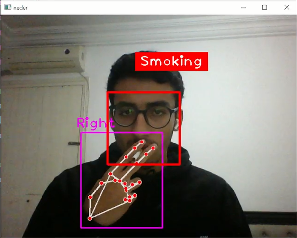
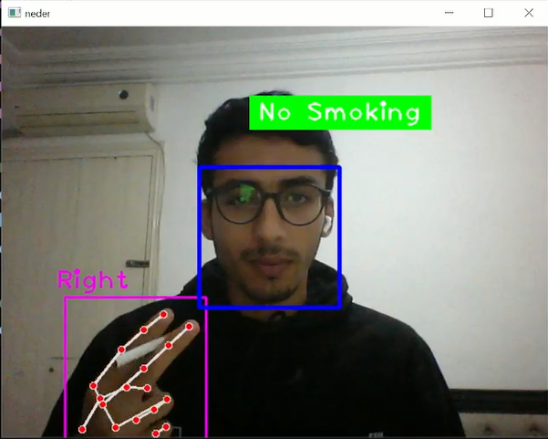

# 🚭 Smoking Detection Project

  

> **Developed by: [Mejri Neder](mailto:bougossanader1s3@gmail.com)**  
> Detect smoking behavior in real-time using computer vision and Python.

---

## 📋 Overview
This project detects smoking behavior by analyzing the proximity of the **hand** to the **face** in real-time. The system uses **OpenCV**, **CVZone**, and **Mediapipe** for hand and face detection.

### Features:
- Real-time **face** and **hand detection**.
- Displays simple messages: **Smoking** or **No Smoking**.
- Lightweight and easy-to-use Python script.

---

## 🖼 Demo

### Smoking Detected:


### No Smoking Detected:


---

## 🚀 Installation and Setup

### Step 1: Clone the repository
```bash
git clone https://github.com/your-username/smoking_detection.git
---
### Step 2: Install dependencies

pip install opencv-python cvzone mediapipe
---
### Step 3: Run the script
python smoking_detection.py

---

## 📧 Contact
For questions or support, feel free to contact:
📧 Mejri Neder - bougossanader1s3@gmail.com
